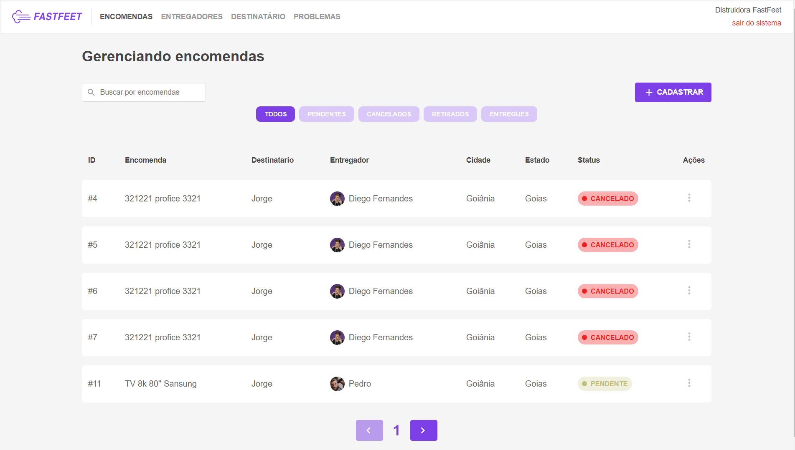

<h1 align="center">
    
</h1>

<h3 align="center">
  Fast Feet: 
</h3>

  <a href="#rocket-sobre-o-desafio">Sobre</a>&nbsp;&nbsp;&nbsp;|&nbsp;&nbsp;&nbsp;
  <a href='#gear-oque-foi-utilizado'>Oque foi utilizado</a>&nbsp;&nbsp;&nbsp;|&nbsp;&nbsp;&nbsp;
  <a href="#camera-imagens">Imagens</a>

## 🚚 Sobre

 Fast Feet é sistema que auxilia no gerenciamento das entregas de mercadorias.

## ⚙️ Oque foi utilizado
<ul>
  <li>React hooks</li>
  <li>Redux</li>
  <li>Redux Persist</li>
  <li>Redux Saga</li>
  <li>Select</li>
  <li>React Select</li>
  <li>Axios</li>
</ul>

## 📷 Imagens

